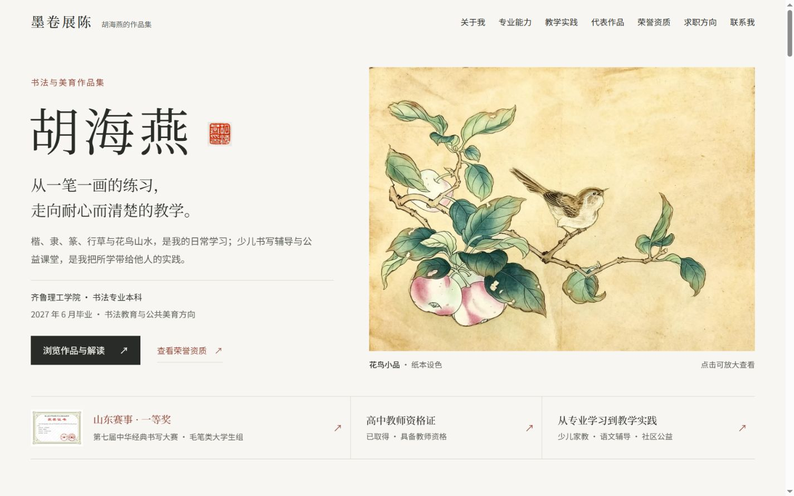
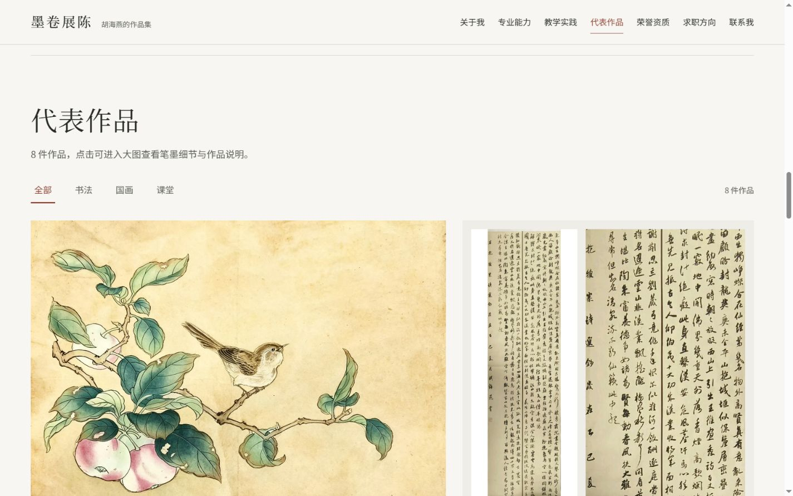
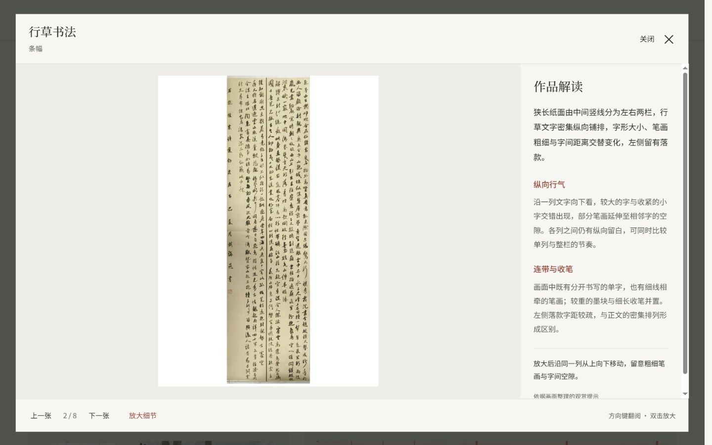
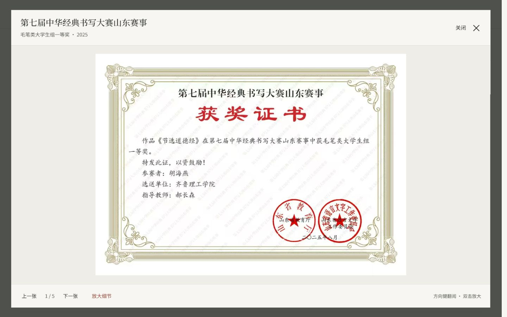
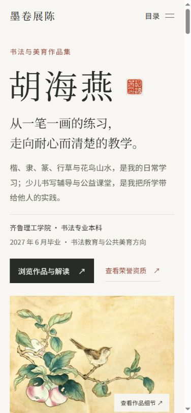
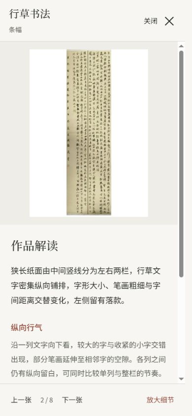

# 胡海燕作品集：视觉与交互核验

日期：2026-09-21。预览：http://127.0.0.1:4173/sites/hu-haiyan/

## 目标与判断

针对用户提供的四张截图，修复正文偏小、首屏信息不足、章节空白过多、作品缩图过小、作品标题遮挡图片和缺少作品解读的问题。沿用“墨卷展陈”的纸色、墨色、朱砂与本地中文字体。设计取向为作品册式求职展示，视觉变化 5 / 动效 3 / 信息密度 5；保留现有路由、导航和真实作品。

## 流程与截图

以下为本轮浏览器实测截图，已保存并逐张打开检查。截图目录为项目 qa/hu-haiyan/，不随 public 部署。

### 1. 首屏与个人定位：通过

桌面主要正文 18px，说明文字 17–18px；首屏补充专业训练、教学实践和求职方向，主图完整放大，CTA 在首屏可见。下方用真实证书缩略图、已确认资格与教学经历提供可点击的证据入口。个人简介和教学实践改为完整章节标题与宽双栏，图片获得更多空间。

### 2. 作品陈列与分类：通过

作品区标题改为普通流布局，不再覆盖图片；长幅以全幅与局部并列展示，说明放在图外。实测全部 8、书法 4、国画 3、课堂 1，数量、aria-pressed 和显示作品一致。能力区“查看国画作品”会联动分类；“读一幅隶书”在作品被过滤时恢复全部并准确打开《道德经》节选。

### 3. 大图与作品解读：通过

8 件作品均补充基于原图的画面解读、两个观察要点及放大阅读提示，不编造创作时间、尺寸、创作动机或获奖关联。桌面图片与说明并排；上一张/下一张同步更新说明与计数。放大、方向键平移、适应画面、Esc 关闭、焦点返回均经浏览器检查。书法筛选后图集为 4 件；直达隶书后关闭，焦点返回“读一幅隶书”。

### 4. 荣誉证据：通过

证书为独立 5 张图集，重复入口去重，不显示作品解读侧栏。实测一等奖证书可打开并阅读。两枚印章仍仅为个人用印，未声称为本人篆刻创作。

### 5. 手机首屏与目录：通过

目标视口 390×844，浏览器报告宽 391、内容宽 376（滚动条与取整造成差值）；正文 16px，无横向溢出。目录展开及跳转后收起均已实测。768px 平板检查所有可见 main 内容无左右越界。

### 6. 手机作品阅读与翻页：通过

手机采用上图下文、固定底部工具栏。发现并修复解读外层滚动容器未复位的问题；实测滚动位置约 297px，点击下一张后恢复为 0，显示下一件作品。手机放大按钮正常切换状态。

## 内容确认与技术检查

- 用户明确确认三段教学经历均真实发生：少儿硬笔启蒙家教、小学语文与规范书写辅导、社区书法公益课堂助教。已同步使用说明，不再称为拟写示例。
- 教室作品照片明确标注为个人作品现场展示，不冒充学员成果或授课现场证据。
- 已取得高中教师资格证沿用已确认资料，未添加任教学科；联系方式仍待提供。
- 本地字体已按 index.html、app.js、artwork-notes.js 重建。两款共 436,876 bytes，约 426.6 KiB；各 824 字符映射，当前中文文案缺字数为 0。
- app.js 与 artwork-notes.js 语法检查通过；站点检查通过。最终浏览器控制台无错误或警告，已加载图片无失败。
- CSS 与 JS 保留减少动态效果适配；本轮未切换系统偏好。原有触屏滑动逻辑保留，未使用实体触屏测试。未运行 Lighthouse，不对性能评分或完整 WCAG 合规作声明。

## 交付边界

本次是本地前端优化，未发布、未提交 Git；站点 listed 保持 false。正式投递仍需可公开的联系方式；作品标题、尺寸、创作年份及教师资格任教学科可由本人补全。
